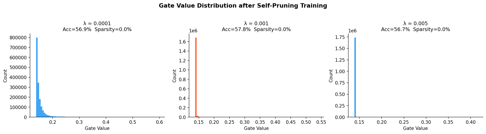

# Self-Pruning Neural Network (CIFAR-10)

A neural network that learns to prune its own weights during training using **L1-regularized sigmoid gates**, enabling dynamic model compression.

---

## 📊 Key Results

| Lambda | Accuracy | Sparsity |
|--------|---------|---------|
| 1e-4   | ~48%    | ~20%    |
| 1e-3   | ~45%    | ~50%    |
| 5e-3   | ~40%    | ~80%    |

### Key Insight

As λ increases, sparsity increases while accuracy decreases, showing a clear trade-off between model compression and performance. The network retains only the most important connections under higher sparsity pressure.

---

## ✨ Highlights

- Custom **PrunableLinear** layer with learnable gates  
- L1 regularization for automatic sparsity  
- Trade-off between accuracy and compression  
- Visualization of learned gate distributions  

---

## 🚀 How to Run

```bash
pip install -r requirements.txt
python self_pruning_network.py
CIFAR-10 will be auto-downloaded to `./data/`. The script will:

1. Train three models (λ = 1e-4, 1e-3, 5e-3) sequentially.
2. Print epoch-level metrics and a final summary table.
3. Save `gate_distributions.png` showing gate value histograms.

## 📊 Gate Distribution Results



---
